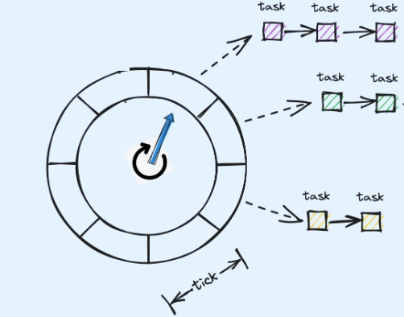

# time_wheel


Go语言实现的一个简单时间轮，用于管理和调度单次任务、间隔周期任务、秒级的cron表达式的定时任务。
## 功能

- 支持单次延时任务
- 支持间隔任务 如每5秒执行一次
- 支持cron表达式任务 如每分钟执行一次
- 支持时区设置

## 开始

### 安装依赖

```bash
go get -u github.com/GalaxyFall/time_wheel
```

# 单次示例
```go
package main

import "github.com/GalaxyFall/time_wheel"

    tWheel := time_wheel.NewTimeWheel(5, time.Second)

    testfunc := func() {
	//do something
    }

    tWheel.AddTask("test after 1s", time_wheel.WrapperTask(testfunc), time.Now().Add(time.Second))
    tWheel.AddTask("test after 3s", time_wheel.WrapperTask(testfunc), time.Now().Add(time.Second*3))

    tWheel.Start()
    <-time.After(6 * time.Second)
```
# 间隔示例

```go
package main

import "github.com/GalaxyFall/time_wheel"

    tWheel := time_wheel.NewTimeWheel(5, time.Second)

    testfunc := func() {
	//do something
    }

    tWheel.AddPeriodicTask("test 2s", time_wheel.WrapperTask(testfunc), time.Second*2)

    tWheel.Start()
    <-time.After(10 * time.Second)
```

# cron示例

```go
package main

import "github.com/GalaxyFall/time_wheel"

    tWheel := time_wheel.NewTimeWheel(5, time.Second)

    testfunc := func() {
	//do something
    }

    tWheel.AddCronTask("test 5s", "*/5 * * * * *", time_wheel.WrapperTask(testfunc))

    tWheel.Start()
    <-time.After(15 * time.Second)
```

### 许可证
本项目采用 MIT 许可证。